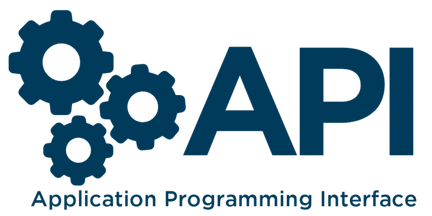

# API
My works related to Application Programming Interface (API)

## Table of Contents
1. [Introduction.](#introduction)
2. [Official references websites.](#references)
3. [GitHub notes.](#github)

<a name="introduction"></a>
## 1. Introduction.
 
An application programming interface (API) is an interface or communication protocol between different parts of a computer program intended to simplify the implementation and maintenance of software. An API may be for a web-based system, operating system, database system, computer hardware, or software library. The API is not the database or even the server, it is the code that governs the access point(s) for the server. <br /><br />

Application programming interface (API) is the system of tools and resources in an operating system enabling developers to create software applications. An API specification can take many forms, but often includes specifications for routines, data structures, object classes, variables, or remote calls. POSIX, Windows API and ASPI are examples of different forms of APIs. Documentation for the API usually is provided to facilitate usage and implementation.

Large tech companies, especially social media companies frequently make their aggregate data available to the public, but APIs are also maintained by government organizations, conferences, publishing houses, software startups, fan groups, eSports leagues and even individuals, in order to share anything from social media content to trivia questions, rankings, maps, song lyrics, recipes, parts lists and more.

To summarize, when a company offers an API to their customers, it just means that they’ve built a set of dedicated URLs that return pure data responses — meaning the responses won’t contain the kind of presentational overhead that you would expect in a graphical user interface like a website.

<a name="shortcuts"></a>
## 2. Official references websites.

**_console API by Mozilla_** <br />
console.error() by Mozilla : https://developer.mozilla.org/en-US/docs/Web/API/Console/error <br />
console.log() by Mozilla : https://developer.mozilla.org/en-US/docs/Web/API/Console/log <br />
console.warn() by Mozilla : https://developer.mozilla.org/en-US/docs/Web/API/Console/warn <br />
console.assert() by Mozilla : https://developer.mozilla.org/en-US/docs/Web/API/console/assert <br />
console.dir() by Mozilla : https://developer.mozilla.org/en-US/docs/Web/API/Console/dir <br />
console.table() by Mozilla : https://developer.mozilla.org/en-US/docs/Web/API/Console/table <br />
console.clear() by Mozilla : https://developer.mozilla.org/en-US/docs/Web/API/Console/clear <br />
console.group() by Mozilla : https://developer.mozilla.org/en-US/docs/Web/API/Console/group <br />
console.groupEnd() by Mozilla : https://developer.mozilla.org/en-US/docs/Web/API/Console/groupEnd <br />
console.time() by Mozilla : https://developer.mozilla.org/en-US/docs/Web/API/Console/time <br />
console.timeEnd() by Mozilla : https://developer.mozilla.org/en-US/docs/Web/API/Console/timeEnd <br />
console by Mozilla : https://developer.mozilla.org/en-US/docs/Web/API/console <br />

**_Document API by Mozilla_** <br />
Document by Mozilla : https://developer.mozilla.org/en-US/docs/Web/API/Document <br />
Document.URL by Mozilla : https://developer.mozilla.org/en-US/docs/Web/API/Document/URL <br />
Document.body by Mozilla : https://developer.mozilla.org/en-US/docs/Web/API/Document/body <br />
Document.head by Mozilla : https://developer.mozilla.org/en-US/docs/Web/API/Document/head <br />
Document.querySelector() by Mozilla : https://developer.mozilla.org/en-US/docs/Web/API/Document/querySelector <br />
Document.querySelectorAll() by Mozilla : https://developer.mozilla.org/en-US/docs/Web/API/Document/querySelectorAll <br />

**_Document Object Model (DOM) by Mozilla_** <br />
Locating DOM elements using selectors by Mozilla : https://developer.mozilla.org/en-US/docs/Web/API/Document_object_model/Locating_DOM_elements_using_selectors <br />

**_Element by Mozilla_** <br />
Element.innerHTML by Mozilla : https://developer.mozilla.org/en-US/docs/Web/API/Element/innerHTML <br />
Element.setAttribute() by Mozilla : https://developer.mozilla.org/en-US/docs/Web/API/Element/setAttribute <br />
Element.classList by Mozilla : https://developer.mozilla.org/en-US/docs/Web/API/Element/classList <br />
Element: mouseenter event by Mozilla : https://developer.mozilla.org/en-US/docs/Web/API/Element/mouseenter_event <br />
Element: mouseleave event by Mozilla : https://developer.mozilla.org/en-US/docs/Web/API/Element/mouseleave_event <br />

**_Event by Mozilla_** <br />
Event by Mozilla : https://developer.mozilla.org/en-US/docs/web/api/event <br />
EventListener by Mozilla :https://developer.mozilla.org/en-US/docs/Web/API/EventListener <br />
Event.preventDefault() by Mozilla : https://developer.mozilla.org/en-US/docs/Web/API/Event/preventDefault <br />
Event.stopPropagation() by Mozilla : https://developer.mozilla.org/en-US/docs/Web/API/Event/stopPropagation <br />

**_HTMLCollection by Mozilla_** <br />
HTMLCollection by Mozilla : https://developer.mozilla.org/en-US/docs/Web/API/HTMLCollection <br />

**_HTMLElement by Mozilla_** <br />
HTMLElement.click() by Mozilla : https://developer.mozilla.org/en-US/docs/Web/API/HTMLElement/click <br />
Element.scrollTop by Mozilla : https://developer.mozilla.org/en-US/docs/Web/API/Element/scrollTop <br />

**_Node by Mozilla_** <br />
Node.parentElement by Mozilla : https://developer.mozilla.org/en-US/docs/Web/API/Node/parentElement <br />
Node.nextSibling by Mozilla : https://developer.mozilla.org/en-US/docs/Web/API/Node/nextSibling <br />
Node.previousSibling by Mozilla : https://developer.mozilla.org/en-US/docs/Web/API/Node/previousSibling <br />
Node.textContent by Mozilla : https://developer.mozilla.org/en-US/docs/Web/API/Node/textContent <br />

**_NodeList by Mozilla_** <br />
NodeList by Mozilla : https://developer.mozilla.org/en-US/docs/Web/API/NodeList <br />

**_NonDocumentTypeChildNode by Mozilla_** <br />
NonDocumentTypeChildNode.nextElementSibling by Mozilla : https://developer.mozilla.org/en-US/docs/Web/API/NonDocumentTypeChildNode/nextElementSibling <br />
NonDocumentTypeChildNode.previousElementSibling by Mozilla : https://developer.mozilla.org/en-US/docs/Web/API/NonDocumentTypeChildNode/previousElementSibling <br />

**_Window by Mozilla_** <br />
Window.alert() by Mozilla : https://developer.mozilla.org/en-US/docs/Web/API/Window/alert <br />
Window by Mozilla : https://developer.mozilla.org/en-US/docs/Web/API/Window <br />
Window.scroll() by Mozilla : https://developer.mozilla.org/en-US/docs/Web/API/Window/scroll <br />
Window.innerHeight by Mozilla : https://developer.mozilla.org/en-US/docs/Web/API/Window/innerHeight <br />

**_WindowOrWorkerGlobalScope by Mozilla_** <br />
WindowOrWorkerGlobalScope.setInterval() by Mozilla : https://developer.mozilla.org/en-US/docs/Web/API/WindowOrWorkerGlobalScope/setInterval <br />
WindowOrWorkerGlobalScope.clearInterval() by Mozilla : https://developer.mozilla.org/en-US/docs/Web/API/WindowOrWorkerGlobalScope/clearInterval <br />
JavaScript WindowOrWorkerGlobalScope.setTimeout() by Mozilla : https://developer.mozilla.org/en-US/docs/Web/API/WindowOrWorkerGlobalScope/setTimeout <br />

**_XMLHttpRequest by Mozilla_** <br />
Using XMLHttpRequest by Mozilla : https://developer.mozilla.org/en-US/docs/Web/API/XMLHttpRequest/Using_XMLHttpRequest <br />

<a name="github"></a>
## 3. GitHub notes.
Clone the current GitHub remote repository contents into local machine.
```
$ git clone https://github.com/syakirharis25/API.git
$ cd API/
$ git remote -v
$ git status
```
